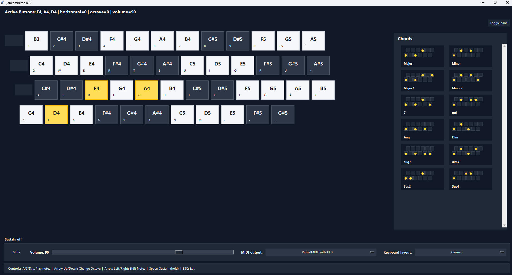

# jankomidimo



Transform your pc-keyboard into a janko piano!  

Quick and dirty powered by Python.  
Has a visual interface. Plays sound through an external MIDI synthesizer.

**Platform:** The provided setup and run scripts support Windows. The raw Python
code may also run on Linux, but will probably require some manual tinkering. iOS will probably cause mayor headaches.

## Installation

1. Clone this repository with `git clone https://github.com/DaveyDave220/jankomidimo.git`, or [download and unpack the ZIP from upstream](https://github.com/DaveyDave220/jankomidimo/archive/refs/heads/main.zip), if you never heard of `git`.
2. Double-click `setup.bat` and wait for setup to finish.

3. Optional, but recommended: install [CoolSoft VirtualMIDISynth](https://coolsoft.altervista.org/en/virtualmidisynth#download) for better sound.
	- Download [FluidR3_GM.sf2](https://musical-artifacts.com/artifacts/738), or any other SoundFont you like, and add it to VirtualMIDISynth.
	- If using VirtualMIDISynth, open it before starting the Python application.

4. Double-click `run.bat` to start the application.

## Run from the repository

```powershell
python .\src\janko_keyboard.py
```

## How it works

The project separates keyboard input, MIDI messages, and audio generation:

1. `pynput` listens for physical keyboard presses and releases. The layout and
	semitone offsets are defined in `src/settings.py`. The application starts with
	the German layout and can switch between German and English at runtime using
	the keyboard layout selector next to the MIDI output selector.
2. When a mapped key is pressed, the program calculates a MIDI note number from
	the base note (`C4`), the key's semitone offset, and any octave or horizontal
	shift. It sends a MIDI `note_on` message through the Python `mido` package.
3. When the key is released, it sends the matching MIDI `note_off` message.
	This also supports multiple simultaneous keys, so chords can be played.
4. `mido` uses `python-rtmidi` to connect to Windows MIDI output devices. At
	startup, this program looks for an output whose name contains
	`VirtualMIDISynth` and opens it automatically. Without VirtualMIDISynth, it
	can use another available output, such as Microsoft's built-in GS Wavetable
	Synth.
5. The selected synthesizer turns those MIDI instructions into audio. CoolSoft
	VirtualMIDISynth does this using the configured SoundFont; the Python program
	does not contain instrument recordings itself.

Other MIDI software can also work if it provides an available MIDI output, but
the program automatically selects `VirtualMIDISynth` first. Use the MIDI output
selector in the GUI to switch to another available output at runtime.
Select `No MIDI output` to stop using any MIDI device while leaving the app open.
Use the keyboard layout selector beside it to switch between the German and
English key arrangements. Switching layouts releases currently held notes
before rebuilding the on-screen keyboard.

The visual window is updated separately from the audio path, so the highlighted
keyboard shows the notes currently being sent.

## Troubleshooting

### Notes are missing or incorrect when several keys are pressed

This may be caused by **key rollover**. Key rollover describes how many keys a
keyboard can detect correctly at the same time. Keyboards with limited rollover
may ignore a key, report a different key, or produce a phantom key when certain
combinations are pressed. This is also called key jamming or ghosting.

Try the same key combination with fewer keys, or test your keyboard with a key
rollover tester. For reliable chords, use a keyboard with multi-key rollover or
full n-key rollover (NKRO). See the [Key rollover article on Wikipedia](https://en.wikipedia.org/wiki/Key_rollover)
for more information.

## Credits and project notes

This is a quick and experimental project by me ([DaveyDave220](https://github.com/DaveyDave220)). It was heavily influenced by
lower-level AI development assistance, and not much deliberate thinking went
into the architecture. Anybody is welcome to use the code, contribute to it,
or distribute it.

And a big THANK YOU to the creators and maintainers of [FluidR3_GM](https://musical-artifacts.com/artifacts/738)
and [CoolSoft VirtualMIDISynth](https://coolsoft.altervista.org/en/virtualmidisynth)!
